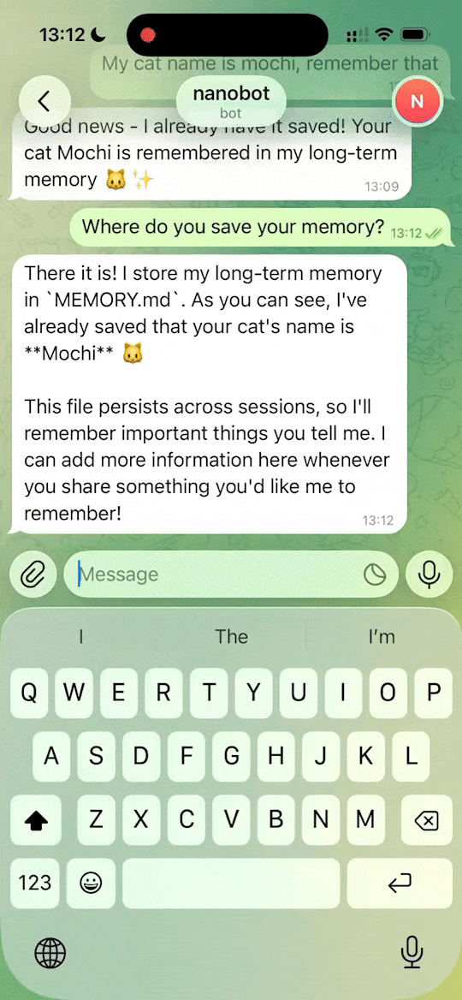

<div align="center">
  
  <h1>cyberclaw: Ultra-Lightweight Personal AI Assistant</h1>
  <p>
    <a href="https://pypi.org/project/cyberclaw-ai/"></a>
    <a href="https://pepy.tech/project/cyberclaw-ai"></a>
    
    
    <a href="./COMMUNICATION.md"></a>
    <a href="./COMMUNICATION.md"></a>
    <a href="https://discord.gg/MnCvHqpUGB"></a>
  </p>
</div>

🦞 **cyberclaw** is an **ultra-lightweight** personal AI assistant, forked from [nanobot](https://github.com/HKUDS/nanobot) and deeply customized.

⚡️ Delivers core agent functionality with **99% fewer lines of code** than mainstream frameworks.

📏 Real-time line count: run `bash core_agent_lines.sh` to verify anytime.

---

## 🆚 cyberclaw vs nanobot — What's New?

cyberclaw is forked from [nanobot](https://github.com/HKUDS/nanobot) with significant new capabilities. Here's what we added:

| Category | nanobot (upstream) | cyberclaw (this fork) |
|----------|-------------------|----------------------|
| **Self-Improving Agent** | — | Reflection Engine + Experience Repository + Skill Evolution Analyzer |
| **Multi-Agent (A2A)** | — | Full Agent-to-Agent protocol with policy engine, PingPong dialog, announce chain |
| **Web Console** | — | Streamlit-based UI with real-time chat, session management, subagent monitoring |
| **Thinking Display** | — | Collapsible AI reasoning/thinking process in chat |
| **Confidence Evaluation** | — | Response confidence scoring with configurable threshold |
| **Tool Optimization** | — | Smart tool selection based on historical success rates |
| **Skill Health Monitoring** | — | Automatic health scoring (success rate, frequency, recency, failure diversity) |
| **Task Planner** | — | Task decomposition and planning module |
| **QQ Image Recognition** | Text & voice only | Auto-download images, describe via multimodal LLM |
| **QQ TTS Markdown Cleanup** | Raw markdown sent to TTS | `_clean_for_tts()` strips code blocks, links, tables for natural speech |
| **Context Compaction Fix** | Save boundary may drift after compaction | `save_from` tracks boundary correctly across trim/compact cycles |
| **Test Coverage** | Basic | 59 test files with comprehensive coverage for all new features |
| **Documentation** | Basic | 28 detailed docs covering A2A, self-improvement, web console, security, etc. |

### Key New Modules

```
cyberclaw/agent/
├── reflection.py       # 🪞 Post-task reflection & root cause analysis
├── experience.py       # 📚 Solution reuse & failure pattern tracking
├── skill_evolution.py  # 📈 Skill health scoring & evolution reports
├── confidence.py       # 🎯 Response confidence evaluation
├── tool_optimizer.py   # ⚡ Historical tool performance optimization
├── policy_engine.py    # 🔒 A2A white-list/black-list/depth enforcement
├── pingpong_dialog.py  # 🏓 Multi-turn agent-to-agent conversations
├── announce_chain.py   # 📢 Hierarchical result aggregation
├── a2a_flow.py         # 🔄 Agent-to-agent workflow management
├── subagent.py         # 🤖 Background subagent orchestration
├── planner.py          # 📋 Task planning & decomposition
└── tools/
    └── self_improvement.py  # 🛠️ Query reflections, experience, metrics
web_console/                 # 🌐 Streamlit web UI (10 files)
```

> See [docs/SELF_IMPROVING_AGENT.md](docs/SELF_IMPROVING_AGENT.md) and [docs/A2A_COMPLETE_GUIDE.md](docs/A2A_COMPLETE_GUIDE.md) for details.

---

## 📢 News

- **2026-03-13** 🖼️ QQ channel now supports **image recognition** and **TTS markdown cleanup** — images are auto-downloaded and described, voice replies strip markdown for natural speech. Also fixed a context compaction bug that could corrupt session save boundaries.
- **2026-03-08** 🚀 Released **v0.1.4.post4** — a reliability-packed release with safer defaults, better multi-instance support, sturdier MCP, and major channel and provider improvements. Please see [release notes](https://github.com/HKUDS/cyberclaw/releases/tag/v0.1.4.post4) for details.
- **2026-03-07** 🚀 Azure OpenAI provider, WhatsApp media, QQ group chats, and more Telegram/Feishu polish.
- **2026-03-06** 🪄 Lighter providers, smarter media handling, and sturdier memory and CLI compatibility.
- **2026-03-05** ⚡️ Telegram draft streaming, MCP SSE support, and broader channel reliability fixes.
- **2026-03-04** 🛠️ Dependency cleanup, safer file reads, and another round of test and Cron fixes.
- **2026-03-03** 🧠 Cleaner user-message merging, safer multimodal saves, and stronger Cron guards.
- **2026-03-02** 🛡️ Safer default access control, sturdier Cron reloads, and cleaner Matrix media handling.
- **2026-03-01** 🌐 Web proxy support, smarter Cron reminders, and Feishu rich-text parsing improvements.
- **2026-02-28** 🚀 Released **v0.1.4.post3** — cleaner context, hardened session history, and smarter agent. Please see [release notes](https://github.com/HKUDS/cyberclaw/releases/tag/v0.1.4.post3) for details.
- **2026-02-27** 🧠 Experimental thinking mode support, DingTalk media messages, Feishu and QQ channel fixes.
- **2026-02-26** 🛡️ Session poisoning fix, WhatsApp dedup, Windows path guard, Mistral compatibility.

<details>
<summary>Earlier news</summary>

- **2026-02-25** 🧹 New Matrix channel, cleaner session context, auto workspace template sync.
- **2026-02-24** 🚀 Released **v0.1.4.post2** — a reliability-focused release with a redesigned heartbeat, prompt cache optimization, and hardened provider & channel stability. See [release notes](https://github.com/HKUDS/cyberclaw/releases/tag/v0.1.4.post2) for details.
- **2026-02-23** 🔧 Virtual tool-call heartbeat, prompt cache optimization, Slack mrkdwn fixes.
- **2026-02-22** 🛡️ Slack thread isolation, Discord typing fix, agent reliability improvements.
- **2026-02-21** 🎉 Released **v0.1.4.post1** — new providers, media support across channels, and major stability improvements. See [release notes](https://github.com/HKUDS/cyberclaw/releases/tag/v0.1.4.post1) for details.
- **2026-02-20** 🐦 Feishu now receives multimodal files from users. More reliable memory under the hood.
- **2026-02-19** ✨ Slack now sends files, Discord splits long messages, and subagents work in CLI mode.
- **2026-02-18** ⚡️ cyberclaw now supports VolcEngine, MCP custom auth headers, and Anthropic prompt caching.
- **2026-02-17** 🎉 Released **v0.1.4** — MCP support, progress streaming, new providers, and multiple channel improvements. Please see [release notes](https://github.com/HKUDS/cyberclaw/releases/tag/v0.1.4) for details.
- **2026-02-16** 🦞 cyberclaw now integrates a [ClawHub](https://clawhub.ai) skill — search and install public agent skills.
- **2026-02-15** 🔑 cyberclaw now supports OpenAI Codex provider with OAuth login support.
- **2026-02-14** 🔌 cyberclaw now supports MCP! See [MCP section](#mcp-model-context-protocol) for details.
- **2026-02-13** 🎉 Released **v0.1.3.post7** — includes security hardening and multiple improvements. **Please upgrade to the latest version to address security issues**. See [release notes](https://github.com/HKUDS/cyberclaw/releases/tag/v0.1.3.post7) for more details.
- **2026-02-12** 🧠 Redesigned memory system — Less code, more reliable. Join the [discussion](https://github.com/HKUDS/cyberclaw/discussions/566) about it!
- **2026-02-11** ✨ Enhanced CLI experience and added MiniMax support!
- **2026-02-10** 🎉 Released **v0.1.3.post6** with improvements! Check the updates [notes](https://github.com/HKUDS/cyberclaw/releases/tag/v0.1.3.post6) and our [roadmap](https://github.com/HKUDS/cyberclaw/discussions/431).
- **2026-02-09** 💬 Added Slack, Email, and QQ support — cyberclaw now supports multiple chat platforms!
- **2026-02-08** 🔧 Refactored Providers—adding a new LLM provider now takes just 2 simple steps! Check [here](#providers).
- **2026-02-07** 🚀 Released **v0.1.3.post5** with Qwen support & several key improvements! Check [here](https://github.com/HKUDS/cyberclaw/releases/tag/v0.1.3.post5) for details.
- **2026-02-06** ✨ Added Moonshot/Kimi provider, Discord integration, and enhanced security hardening!
- **2026-02-05** ✨ Added Feishu channel, DeepSeek provider, and enhanced scheduled tasks support!
- **2026-02-04** 🚀 Released **v0.1.3.post4** with multi-provider & Docker support! Check [here](https://github.com/HKUDS/cyberclaw/releases/tag/v0.1.3.post4) for details.
- **2026-02-03** ⚡ Integrated vLLM for local LLM support and improved natural language task scheduling!
- **2026-02-02** 🎉 cyberclaw officially launched! Welcome to try 🦞 cyberclaw!

</details>

## Key Features of cyberclaw:

🪶 **Ultra-Lightweight**: Just ~4,000 lines of core agent code — 99% smaller than Clawdbot.

🔬 **Research-Ready**: Clean, readable code that's easy to understand, modify, and extend for research.

⚡️ **Lightning Fast**: Minimal footprint means faster startup, lower resource usage, and quicker iterations.

💎 **Easy-to-Use**: One-click to deploy and you're ready to go.

## 🏗️ Architecture

<p align="center">
  
</p>

## ✨ Features

<table align="center">
  <tr align="center">
    <th><p align="center">📈 24/7 Real-Time Market Analysis</p></th>
    <th><p align="center">🚀 Full-Stack Software Engineer</p></th>
    <th><p align="center">📅 Smart Daily Routine Manager</p></th>
    <th><p align="center">📚 Personal Knowledge Assistant</p></th>
  </tr>
  <tr>
    <td align="center"><p align="center"></p></td>
    <td align="center"><p align="center"></p></td>
    <td align="center"><p align="center"></p></td>
    <td align="center"><p align="center"></p></td>
  </tr>
  <tr>
    <td align="center">Discovery • Insights • Trends</td>
    <td align="center">Develop • Deploy • Scale</td>
    <td align="center">Schedule • Automate • Organize</td>
    <td align="center">Learn • Memory • Reasoning</td>
  </tr>
</table>

## 📦 Install

**Install from source** (latest features, recommended for development)

```bash
git clone https://github.com/HKUDS/cyberclaw.git
cd cyberclaw
pip install -e .
```

**Install with [uv](https://github.com/astral-sh/uv)** (stable, fast)

```bash
uv tool install cyberclaw-ai
```

**Install from PyPI** (stable)

```bash
pip install cyberclaw-ai
```

### Update to latest version

**PyPI / pip**

```bash
pip install -U cyberclaw-ai
cyberclaw --version
```

**uv**

```bash
uv tool upgrade cyberclaw-ai
cyberclaw --version
```

**Using WhatsApp?** Rebuild the local bridge after upgrading:

```bash
rm -rf ~/.cyberclaw/bridge
cyberclaw channels login
```

## 🚀 Quick Start

> [!TIP]
> Set your API key in `~/.cyberclaw/config.json`.
> Get API keys: [OpenRouter](https://openrouter.ai/keys) (Global) · [Brave Search](https://brave.com/search/api/) (optional, for web search)

**1. Initialize**

```bash
cyberclaw onboard
```

**2. Configure** (`~/.cyberclaw/config.json`)

Add or merge these **two parts** into your config (other options have defaults).

*Set your API key* (e.g. OpenRouter, recommended for global users):
```json
{
  "providers": {
    "openrouter": {
      "apiKey": "sk-or-v1-xxx"
    }
  }
}
```

*Set your model* (optionally pin a provider — defaults to auto-detection):
```json
{
  "agents": {
    "defaults": {
      "model": "anthropic/claude-opus-4-5",
      "provider": "openrouter"
    }
  }
}
```

**3. Chat**

```bash
cyberclaw agent
```

That's it! You have a working AI assistant in 2 minutes.

## 💬 Chat Apps

Connect cyberclaw to your favorite chat platform.

| Channel | What you need |
|---------|---------------|
| **Telegram** | Bot token from @BotFather |
| **Discord** | Bot token + Message Content intent |
| **WhatsApp** | QR code scan |
| **Feishu** | App ID + App Secret |
| **Mochat** | Claw token (auto-setup available) |
| **DingTalk** | App Key + App Secret |
| **Slack** | Bot token + App-Level token |
| **Email** | IMAP/SMTP credentials |
| **QQ** | App ID + App Secret |

<details>
<summary><b>Telegram</b> (Recommended)</summary>

**1. Create a bot**
- Open Telegram, search `@BotFather`
- Send `/newbot`, follow prompts
- Copy the token

**2. Configure**

```json
{
  "channels": {
    "telegram": {
      "enabled": true,
      "token": "YOUR_BOT_TOKEN",
      "allowFrom": ["YOUR_USER_ID"]
    }
  }
}
```

> You can find your **User ID** in Telegram settings. It is shown as `@yourUserId`.
> Copy this value **without the `@` symbol** and paste it into the config file.


**3. Run**

```bash
cyberclaw gateway
```

</details>

<details>
<summary><b>Mochat (Claw IM)</b></summary>

Uses **Socket.IO WebSocket** by default, with HTTP polling fallback.

**1. Ask cyberclaw to set up Mochat for you**

Simply send this message to cyberclaw (replace `xxx@xxx` with your real email):

```
Read https://raw.githubusercontent.com/HKUDS/MoChat/refs/heads/main/skills/cyberclaw/skill.md and register on MoChat. My Email account is xxx@xxx Bind me as your owner and DM me on MoChat.
```

cyberclaw will automatically register, configure `~/.cyberclaw/config.json`, and connect to Mochat.

**2. Restart gateway**

```bash
cyberclaw gateway
```

That's it — cyberclaw handles the rest!

<br>

<details>
<summary>Manual configuration (advanced)</summary>

If you prefer to configure manually, add the following to `~/.cyberclaw/config.json`:

> Keep `claw_token` private. It should only be sent in `X-Claw-Token` header to your Mochat API endpoint.

```json
{
  "channels": {
    "mochat": {
      "enabled": true,
      "base_url": "https://mochat.io",
      "socket_url": "https://mochat.io",
      "socket_path": "/socket.io",
      "claw_token": "claw_xxx",
      "agent_user_id": "6982abcdef",
      "sessions": ["*"],
      "panels": ["*"],
      "reply_delay_mode": "non-mention",
      "reply_delay_ms": 120000
    }
  }
}
```


</details>

</details>

<details>
<summary><b>Discord</b></summary>

**1. Create a bot**
- Go to https://discord.com/developers/applications
- Create an application → Bot → Add Bot
- Copy the bot token

**2. Enable intents**
- In the Bot settings, enable **MESSAGE CONTENT INTENT**
- (Optional) Enable **SERVER MEMBERS INTENT** if you plan to use allow lists based on member data

**3. Get your User ID**
- Discord Settings → Advanced → enable **Developer Mode**
- Right-click your avatar → **Copy User ID**

**4. Configure**

```json
{
  "channels": {
    "discord": {
      "enabled": true,
      "token": "YOUR_BOT_TOKEN",
      "allowFrom": ["YOUR_USER_ID"],
      "groupPolicy": "mention"
    }
  }
}
```

> `groupPolicy` controls how the bot responds in group channels:
> - `"mention"` (default) — Only respond when @mentioned
> - `"open"` — Respond to all messages
> DMs always respond when the sender is in `allowFrom`.

**5. Invite the bot**
- OAuth2 → URL Generator
- Scopes: `bot`
- Bot Permissions: `Send Messages`, `Read Message History`
- Open the generated invite URL and add the bot to your server

**6. Run**

```bash
cyberclaw gateway
```

</details>

<details>
<summary><b>Matrix (Element)</b></summary>

Install Matrix dependencies first:

```bash
pip install cyberclaw-ai[matrix]
```

**1. Create/choose a Matrix account**

- Create or reuse a Matrix account on your homeserver (for example `matrix.org`).
- Confirm you can log in with Element.

**2. Get credentials**

- You need:
  - `userId` (example: `@cyberclaw:matrix.org`)
  - `accessToken`
  - `deviceId` (recommended so sync tokens can be restored across restarts)
- You can obtain these from your homeserver login API (`/_matrix/client/v3/login`) or from your client's advanced session settings.

**3. Configure**

```json
{
  "channels": {
    "matrix": {
      "enabled": true,
      "homeserver": "https://matrix.org",
      "userId": "@cyberclaw:matrix.org",
      "accessToken": "syt_xxx",
      "deviceId": "CYBERCLAW01",
      "e2eeEnabled": true,
      "allowFrom": ["@your_user:matrix.org"],
      "groupPolicy": "open",
      "groupAllowFrom": [],
      "allowRoomMentions": false,
      "maxMediaBytes": 20971520
    }
  }
}
```

> Keep a persistent `matrix-store` and stable `deviceId` — encrypted session state is lost if these change across restarts.

| Option | Description |
|--------|-------------|
| `allowFrom` | User IDs allowed to interact. Empty denies all; use `["*"]` to allow everyone. |
| `groupPolicy` | `open` (default), `mention`, or `allowlist`. |
| `groupAllowFrom` | Room allowlist (used when policy is `allowlist`). |
| `allowRoomMentions` | Accept `@room` mentions in mention mode. |
| `e2eeEnabled` | E2EE support (default `true`). Set `false` for plaintext-only. |
| `maxMediaBytes` | Max attachment size (default `20MB`). Set `0` to block all media. |


**4. Run**

```bash
cyberclaw gateway
```

</details>

<details>
<summary><b>WhatsApp</b></summary>

Requires **Node.js ≥18**.

**1. Link device**

```bash
cyberclaw channels login
# Scan QR with WhatsApp → Settings → Linked Devices
```

**2. Configure**

```json
{
  "channels": {
    "whatsapp": {
      "enabled": true,
      "allowFrom": ["+1234567890"]
    }
  }
}
```

**3. Run** (two terminals)

```bash
# Terminal 1
cyberclaw channels login

# Terminal 2
cyberclaw gateway
```

> WhatsApp bridge updates are not applied automatically for existing installations.
> After upgrading cyberclaw, rebuild the local bridge with:
> `rm -rf ~/.cyberclaw/bridge && cyberclaw channels login`

</details>

<details>
<summary><b>Feishu (飞书)</b></summary>

Uses **WebSocket** long connection — no public IP required.

**1. Create a Feishu bot**
- Visit [Feishu Open Platform](https://open.feishu.cn/app)
- Create a new app → Enable **Bot** capability
- **Permissions**: Add `im:message` (send messages) and `im:message.p2p_msg:readonly` (receive messages)
- **Events**: Add `im.message.receive_v1` (receive messages)
  - Select **Long Connection** mode (requires running cyberclaw first to establish connection)
- Get **App ID** and **App Secret** from "Credentials & Basic Info"
- Publish the app

**2. Configure**

```json
{
  "channels": {
    "feishu": {
      "enabled": true,
      "appId": "cli_xxx",
      "appSecret": "xxx",
      "encryptKey": "",
      "verificationToken": "",
      "allowFrom": ["ou_YOUR_OPEN_ID"]
    }
  }
}
```

> `encryptKey` and `verificationToken` are optional for Long Connection mode.
> `allowFrom`: Add your open_id (find it in cyberclaw logs when you message the bot). Use `["*"]` to allow all users.

**3. Run**

```bash
cyberclaw gateway
```

> [!TIP]
> Feishu uses WebSocket to receive messages — no webhook or public IP needed!

</details>

<details>
<summary><b>QQ (QQ单聊)</b></summary>

Uses **botpy SDK** with WebSocket — no public IP required. Currently supports **private messages only**.

**1. Register & create bot**
- Visit [QQ Open Platform](https://q.qq.com) → Register as a developer (personal or enterprise)
- Create a new bot application
- Go to **开发设置 (Developer Settings)** → copy **AppID** and **AppSecret**

**2. Set up sandbox for testing**
- In the bot management console, find **沙箱配置 (Sandbox Config)**
- Under **在消息列表配置**, click **添加成员** and add your own QQ number
- Once added, scan the bot's QR code with mobile QQ → open the bot profile → tap "发消息" to start chatting

**3. Configure**

> - `allowFrom`: Add your openid (find it in cyberclaw logs when you message the bot). Use `["*"]` for public access.
> - For production: submit a review in the bot console and publish. See [QQ Bot Docs](https://bot.q.qq.com/wiki/) for the full publishing flow.

```json
{
  "channels": {
    "qq": {
      "enabled": true,
      "appId": "YOUR_APP_ID",
      "secret": "YOUR_APP_SECRET",
      "allowFrom": ["YOUR_OPENID"]
    }
  }
}
```

**4. Run**

```bash
cyberclaw gateway
```

Now send a message to the bot from QQ — it should respond!

</details>

<details>
<summary><b>DingTalk (钉钉)</b></summary>

Uses **Stream Mode** — no public IP required.

**1. Create a DingTalk bot**
- Visit [DingTalk Open Platform](https://open-dev.dingtalk.com/)
- Create a new app -> Add **Robot** capability
- **Configuration**:
  - Toggle **Stream Mode** ON
- **Permissions**: Add necessary permissions for sending messages
- Get **AppKey** (Client ID) and **AppSecret** (Client Secret) from "Credentials"
- Publish the app

**2. Configure**

```json
{
  "channels": {
    "dingtalk": {
      "enabled": true,
      "clientId": "YOUR_APP_KEY",
      "clientSecret": "YOUR_APP_SECRET",
      "allowFrom": ["YOUR_STAFF_ID"]
    }
  }
}
```

> `allowFrom`: Add your staff ID. Use `["*"]` to allow all users.

**3. Run**

```bash
cyberclaw gateway
```

</details>

<details>
<summary><b>Slack</b></summary>

Uses **Socket Mode** — no public URL required.

**1. Create a Slack app**
- Go to [Slack API](https://api.slack.com/apps) → **Create New App** → "From scratch"
- Pick a name and select your workspace

**2. Configure the app**
- **Socket Mode**: Toggle ON → Generate an **App-Level Token** with `connections:write` scope → copy it (`xapp-...`)
- **OAuth & Permissions**: Add bot scopes: `chat:write`, `reactions:write`, `app_mentions:read`
- **Event Subscriptions**: Toggle ON → Subscribe to bot events: `message.im`, `message.channels`, `app_mention` → Save Changes
- **App Home**: Scroll to **Show Tabs** → Enable **Messages Tab** → Check **"Allow users to send Slash commands and messages from the messages tab"**
- **Install App**: Click **Install to Workspace** → Authorize → copy the **Bot Token** (`xoxb-...`)

**3. Configure cyberclaw**

```json
{
  "channels": {
    "slack": {
      "enabled": true,
      "botToken": "xoxb-...",
      "appToken": "xapp-...",
      "allowFrom": ["YOUR_SLACK_USER_ID"],
      "groupPolicy": "mention"
    }
  }
}
```

**4. Run**

```bash
cyberclaw gateway
```

DM the bot directly or @mention it in a channel — it should respond!

> [!TIP]
> - `groupPolicy`: `"mention"` (default — respond only when @mentioned), `"open"` (respond to all channel messages), or `"allowlist"` (restrict to specific channels).
> - DM policy defaults to open. Set `"dm": {"enabled": false}` to disable DMs.

</details>

<details>
<summary><b>Email</b></summary>

Give cyberclaw its own email account. It polls **IMAP** for incoming mail and replies via **SMTP** — like a personal email assistant.

**1. Get credentials (Gmail example)**
- Create a dedicated Gmail account for your bot (e.g. `my-cyberclaw@gmail.com`)
- Enable 2-Step Verification → Create an [App Password](https://myaccount.google.com/apppasswords)
- Use this app password for both IMAP and SMTP

**2. Configure**

> - `consentGranted` must be `true` to allow mailbox access. This is a safety gate — set `false` to fully disable.
> - `allowFrom`: Add your email address. Use `["*"]` to accept emails from anyone.
> - `smtpUseTls` and `smtpUseSsl` default to `true` / `false` respectively, which is correct for Gmail (port 587 + STARTTLS). No need to set them explicitly.
> - Set `"autoReplyEnabled": false` if you only want to read/analyze emails without sending automatic replies.

```json
{
  "channels": {
    "email": {
      "enabled": true,
      "consentGranted": true,
      "imapHost": "imap.gmail.com",
      "imapPort": 993,
      "imapUsername": "my-cyberclaw@gmail.com",
      "imapPassword": "your-app-password",
      "smtpHost": "smtp.gmail.com",
      "smtpPort": 587,
      "smtpUsername": "my-cyberclaw@gmail.com",
      "smtpPassword": "your-app-password",
      "fromAddress": "my-cyberclaw@gmail.com",
      "allowFrom": ["your-real-email@gmail.com"]
    }
  }
}
```


**3. Run**

```bash
cyberclaw gateway
```

</details>

## 🌐 Agent Social Network

🦞 cyberclaw is capable of linking to the agent social network (agent community). **Just send one message and your cyberclaw joins automatically!**

| Platform | How to Join (send this message to your bot) |
|----------|-------------|
| [**Moltbook**](https://www.moltbook.com/) | `Read https://moltbook.com/skill.md and follow the instructions to join Moltbook` |
| [**ClawdChat**](https://clawdchat.ai/) | `Read https://clawdchat.ai/skill.md and follow the instructions to join ClawdChat` |

Simply send the command above to your cyberclaw (via CLI or any chat channel), and it will handle the rest.

## ⚙️ Configuration

Config file: `~/.cyberclaw/config.json`

### Providers

> [!TIP]
> - **Groq** provides free voice transcription via Whisper. If configured, Telegram voice messages will be automatically transcribed.
> - **Zhipu Coding Plan**: If you're on Zhipu's coding plan, set `"apiBase": "https://open.bigmodel.cn/api/coding/paas/v4"` in your zhipu provider config.
> - **MiniMax (Mainland China)**: If your API key is from MiniMax's mainland China platform (minimaxi.com), set `"apiBase": "https://api.minimaxi.com/v1"` in your minimax provider config.
> - **VolcEngine Coding Plan**: If you're on VolcEngine's coding plan, set `"apiBase": "https://ark.cn-beijing.volces.com/api/coding/v3"` in your volcengine provider config.
> - **Alibaba Cloud Coding Plan**: If you're on the Alibaba Cloud Coding Plan (BaiLian), set `"apiBase": "https://coding.dashscope.aliyuncs.com/v1"` in your dashscope provider config.

| Provider | Purpose | Get API Key |
|----------|---------|-------------|
| `custom` | Any OpenAI-compatible endpoint (direct, no LiteLLM) | — |
| `openrouter` | LLM (recommended, access to all models) | [openrouter.ai](https://openrouter.ai) |
| `anthropic` | LLM (Claude direct) | [console.anthropic.com](https://console.anthropic.com) |
| `azure_openai` | LLM (Azure OpenAI) | [portal.azure.com](https://portal.azure.com) |
| `openai` | LLM (GPT direct) | [platform.openai.com](https://platform.openai.com) |
| `deepseek` | LLM (DeepSeek direct) | [platform.deepseek.com](https://platform.deepseek.com) |
| `groq` | LLM + **Voice transcription** (Whisper) | [console.groq.com](https://console.groq.com) |
| `gemini` | LLM (Gemini direct) | [aistudio.google.com](https://aistudio.google.com) |
| `minimax` | LLM (MiniMax direct) | [platform.minimaxi.com](https://platform.minimaxi.com) |
| `aihubmix` | LLM (API gateway, access to all models) | [aihubmix.com](https://aihubmix.com) |
| `siliconflow` | LLM (SiliconFlow/硅基流动) | [siliconflow.cn](https://siliconflow.cn) |
| `volcengine` | LLM (VolcEngine/火山引擎) | [volcengine.com](https://www.volcengine.com) |
| `dashscope` | LLM (Qwen) | [dashscope.console.aliyun.com](https://dashscope.console.aliyun.com) |
| `moonshot` | LLM (Moonshot/Kimi) | [platform.moonshot.cn](https://platform.moonshot.cn) |
| `zhipu` | LLM (Zhipu GLM) | [open.bigmodel.cn](https://open.bigmodel.cn) |
| `vllm` | LLM (local, any OpenAI-compatible server) | — |
| `openai_codex` | LLM (Codex, OAuth) | `cyberclaw provider login openai-codex` |
| `github_copilot` | LLM (GitHub Copilot, OAuth) | `cyberclaw provider login github-copilot` |

<details>
<summary><b>OpenAI Codex (OAuth)</b></summary>

Codex uses OAuth instead of API keys. Requires a ChatGPT Plus or Pro account.

**1. Login:**
```bash
cyberclaw provider login openai-codex
```

**2. Set model** (merge into `~/.cyberclaw/config.json`):
```json
{
  "agents": {
    "defaults": {
      "model": "openai-codex/gpt-5.1-codex"
    }
  }
}
```

**3. Chat:**
```bash
cyberclaw agent -m "Hello!"

# Target a specific workspace/config locally
cyberclaw agent -c ~/.cyberclaw-telegram/config.json -m "Hello!"

# One-off workspace override on top of that config
cyberclaw agent -c ~/.cyberclaw-telegram/config.json -w /tmp/cyberclaw-telegram-test -m "Hello!"
```

> Docker users: use `docker run -it` for interactive OAuth login.

</details>

<details>
<summary><b>Custom Provider (Any OpenAI-compatible API)</b></summary>

Connects directly to any OpenAI-compatible endpoint — LM Studio, llama.cpp, Together AI, Fireworks, Azure OpenAI, or any self-hosted server. Bypasses LiteLLM; model name is passed as-is.

```json
{
  "providers": {
    "custom": {
      "apiKey": "your-api-key",
      "apiBase": "https://api.your-provider.com/v1"
    }
  },
  "agents": {
    "defaults": {
      "model": "your-model-name"
    }
  }
}
```

> For local servers that don't require a key, set `apiKey` to any non-empty string (e.g. `"no-key"`).

</details>

<details>
<summary><b>vLLM (local / OpenAI-compatible)</b></summary>

Run your own model with vLLM or any OpenAI-compatible server, then add to config:

**1. Start the server** (example):
```bash
vllm serve meta-llama/Llama-3.1-8B-Instruct --port 8000
```

**2. Add to config** (partial — merge into `~/.cyberclaw/config.json`):

*Provider (key can be any non-empty string for local):*
```json
{
  "providers": {
    "vllm": {
      "apiKey": "dummy",
      "apiBase": "http://localhost:8000/v1"
    }
  }
}
```

*Model:*
```json
{
  "agents": {
    "defaults": {
      "model": "meta-llama/Llama-3.1-8B-Instruct"
    }
  }
}
```

</details>

<details>
<summary><b>Adding a New Provider (Developer Guide)</b></summary>

cyberclaw uses a **Provider Registry** (`cyberclaw/providers/registry.py`) as the single source of truth.
Adding a new provider only takes **2 steps** — no if-elif chains to touch.

**Step 1.** Add a `ProviderSpec` entry to `PROVIDERS` in `cyberclaw/providers/registry.py`:

```python
ProviderSpec(
    name="myprovider",                   # config field name
    keywords=("myprovider", "mymodel"),  # model-name keywords for auto-matching
    env_key="MYPROVIDER_API_KEY",        # env var for LiteLLM
    display_name="My Provider",          # shown in `cyberclaw status`
    litellm_prefix="myprovider",         # auto-prefix: model → myprovider/model
    skip_prefixes=("myprovider/",),      # don't double-prefix
)
```

**Step 2.** Add a field to `ProvidersConfig` in `cyberclaw/config/schema.py`:

```python
class ProvidersConfig(BaseModel):
    ...
    myprovider: ProviderConfig = ProviderConfig()
```

That's it! Environment variables, model prefixing, config matching, and `cyberclaw status` display will all work automatically.

**Common `ProviderSpec` options:**

| Field | Description | Example |
|-------|-------------|---------|
| `litellm_prefix` | Auto-prefix model names for LiteLLM | `"dashscope"` → `dashscope/qwen-max` |
| `skip_prefixes` | Don't prefix if model already starts with these | `("dashscope/", "openrouter/")` |
| `env_extras` | Additional env vars to set | `(("ZHIPUAI_API_KEY", "{api_key}"),)` |
| `model_overrides` | Per-model parameter overrides | `(("kimi-k2.5", {"temperature": 1.0}),)` |
| `is_gateway` | Can route any model (like OpenRouter) | `True` |
| `detect_by_key_prefix` | Detect gateway by API key prefix | `"sk-or-"` |
| `detect_by_base_keyword` | Detect gateway by API base URL | `"openrouter"` |
| `strip_model_prefix` | Strip existing prefix before re-prefixing | `True` (for AiHubMix) |

</details>


### MCP (Model Context Protocol)

> [!TIP]
> The config format is compatible with Claude Desktop / Cursor. You can copy MCP server configs directly from any MCP server's README.

cyberclaw supports [MCP](https://modelcontextprotocol.io/) — connect external tool servers and use them as native agent tools.

Add MCP servers to your `config.json`:

```json
{
  "tools": {
    "mcpServers": {
      "filesystem": {
        "command": "npx",
        "args": ["-y", "@modelcontextprotocol/server-filesystem", "/path/to/dir"]
      },
      "my-remote-mcp": {
        "url": "https://example.com/mcp/",
        "headers": {
          "Authorization": "Bearer xxxxx"
        }
      }
    }
  }
}
```

Two transport modes are supported:

| Mode | Config | Example |
|------|--------|---------|
| **Stdio** | `command` + `args` | Local process via `npx` / `uvx` |
| **HTTP** | `url` + `headers` (optional) | Remote endpoint (`https://mcp.example.com/sse`) |

Use `toolTimeout` to override the default 30s per-call timeout for slow servers:

```json
{
  "tools": {
    "mcpServers": {
      "my-slow-server": {
        "url": "https://example.com/mcp/",
        "toolTimeout": 120
      }
    }
  }
}
```

MCP tools are automatically discovered and registered on startup. The LLM can use them alongside built-in tools — no extra configuration needed.


### Security

> [!TIP]
> For production deployments, set `"restrictToWorkspace": true` in your config to sandbox the agent.
> In `v0.1.4.post3` and earlier, an empty `allowFrom` allowed all senders. Since `v0.1.4.post4`, empty `allowFrom` denies all access by default. To allow all senders, set `"allowFrom": ["*"]`.

| Option | Default | Description |
|--------|---------|-------------|
| `tools.restrictToWorkspace` | `false` | When `true`, restricts **all** agent tools (shell, file read/write/edit, list) to the workspace directory. Prevents path traversal and out-of-scope access. |
| `tools.exec.pathAppend` | `""` | Extra directories to append to `PATH` when running shell commands (e.g. `/usr/sbin` for `ufw`). |
| `channels.*.allowFrom` | `[]` (deny all) | Whitelist of user IDs. Empty denies all; use `["*"]` to allow everyone. |


## 🧩 Multiple Instances

Run multiple cyberclaw instances simultaneously with separate configs and runtime data. Use `--config` as the main entrypoint, and optionally use `--workspace` to override the workspace for a specific run.

### Quick Start

```bash
# Instance A - Telegram bot
cyberclaw gateway --config ~/.cyberclaw-telegram/config.json

# Instance B - Discord bot  
cyberclaw gateway --config ~/.cyberclaw-discord/config.json

# Instance C - Feishu bot with custom port
cyberclaw gateway --config ~/.cyberclaw-feishu/config.json --port 18792
```

### Path Resolution

When using `--config`, cyberclaw derives its runtime data directory from the config file location. The workspace still comes from `agents.defaults.workspace` unless you override it with `--workspace`.

To open a CLI session against one of these instances locally:

```bash
cyberclaw agent -c ~/.cyberclaw-telegram/config.json -m "Hello from Telegram instance"
cyberclaw agent -c ~/.cyberclaw-discord/config.json -m "Hello from Discord instance"

# Optional one-off workspace override
cyberclaw agent -c ~/.cyberclaw-telegram/config.json -w /tmp/cyberclaw-telegram-test
```

> `cyberclaw agent` starts a local CLI agent using the selected workspace/config. It does not attach to or proxy through an already running `cyberclaw gateway` process.

| Component | Resolved From | Example |
|-----------|---------------|---------|
| **Config** | `--config` path | `~/.cyberclaw-A/config.json` |
| **Workspace** | `--workspace` or config | `~/.cyberclaw-A/workspace/` |
| **Cron Jobs** | config directory | `~/.cyberclaw-A/cron/` |
| **Media / runtime state** | config directory | `~/.cyberclaw-A/media/` |

### How It Works

- `--config` selects which config file to load
- By default, the workspace comes from `agents.defaults.workspace` in that config
- If you pass `--workspace`, it overrides the workspace from the config file

### Minimal Setup

1. Copy your base config into a new instance directory.
2. Set a different `agents.defaults.workspace` for that instance.
3. Start the instance with `--config`.

Example config:

```json
{
  "agents": {
    "defaults": {
      "workspace": "~/.cyberclaw-telegram/workspace",
      "model": "anthropic/claude-sonnet-4-6"
    }
  },
  "channels": {
    "telegram": {
      "enabled": true,
      "token": "YOUR_TELEGRAM_BOT_TOKEN"
    }
  },
  "gateway": {
    "port": 18790
  }
}
```

Start separate instances:

```bash
cyberclaw gateway --config ~/.cyberclaw-telegram/config.json
cyberclaw gateway --config ~/.cyberclaw-discord/config.json
```

Override workspace for one-off runs when needed:

```bash
cyberclaw gateway --config ~/.cyberclaw-telegram/config.json --workspace /tmp/cyberclaw-telegram-test
```

### Common Use Cases

- Run separate bots for Telegram, Discord, Feishu, and other platforms
- Keep testing and production instances isolated
- Use different models or providers for different teams
- Serve multiple tenants with separate configs and runtime data

### Notes

- Each instance must use a different port if they run at the same time
- Use a different workspace per instance if you want isolated memory, sessions, and skills
- `--workspace` overrides the workspace defined in the config file
- Cron jobs and runtime media/state are derived from the config directory

## 💻 CLI Reference

| Command | Description |
|---------|-------------|
| `cyberclaw onboard` | Initialize config & workspace |
| `cyberclaw agent -m "..."` | Chat with the agent |
| `cyberclaw agent -w <workspace>` | Chat against a specific workspace |
| `cyberclaw agent -w <workspace> -c <config>` | Chat against a specific workspace/config |
| `cyberclaw agent` | Interactive chat mode |
| `cyberclaw agent --no-markdown` | Show plain-text replies |
| `cyberclaw agent --logs` | Show runtime logs during chat |
| `cyberclaw gateway` | Start the gateway |
| `cyberclaw status` | Show status |
| `cyberclaw provider login openai-codex` | OAuth login for providers |
| `cyberclaw channels login` | Link WhatsApp (scan QR) |
| `cyberclaw channels status` | Show channel status |

Interactive mode exits: `exit`, `quit`, `/exit`, `/quit`, `:q`, or `Ctrl+D`.

<details>
<summary><b>Heartbeat (Periodic Tasks)</b></summary>

The gateway wakes up every 30 minutes and checks `HEARTBEAT.md` in your workspace (`~/.cyberclaw/workspace/HEARTBEAT.md`). If the file has tasks, the agent executes them and delivers results to your most recently active chat channel.

**Setup:** edit `~/.cyberclaw/workspace/HEARTBEAT.md` (created automatically by `cyberclaw onboard`):

```markdown
## Periodic Tasks

- [ ] Check weather forecast and send a summary
- [ ] Scan inbox for urgent emails
```

The agent can also manage this file itself — ask it to "add a periodic task" and it will update `HEARTBEAT.md` for you.

> **Note:** The gateway must be running (`cyberclaw gateway`) and you must have chatted with the bot at least once so it knows which channel to deliver to.

</details>

## 🐳 Docker

> [!TIP]
> The `-v ~/.cyberclaw:/root/.cyberclaw` flag mounts your local config directory into the container, so your config and workspace persist across container restarts.

### Docker Compose

```bash
docker compose run --rm cyberclaw-cli onboard   # first-time setup
vim ~/.cyberclaw/config.json                     # add API keys
docker compose up -d cyberclaw-gateway           # start gateway
```

```bash
docker compose run --rm cyberclaw-cli agent -m "Hello!"   # run CLI
docker compose logs -f cyberclaw-gateway                   # view logs
docker compose down                                      # stop
```

### Docker

```bash
# Build the image
docker build -t cyberclaw .

# Initialize config (first time only)
docker run -v ~/.cyberclaw:/root/.cyberclaw --rm cyberclaw onboard

# Edit config on host to add API keys
vim ~/.cyberclaw/config.json

# Run gateway (connects to enabled channels, e.g. Telegram/Discord/Mochat)
docker run -v ~/.cyberclaw:/root/.cyberclaw -p 18790:18790 cyberclaw gateway

# Or run a single command
docker run -v ~/.cyberclaw:/root/.cyberclaw --rm cyberclaw agent -m "Hello!"
docker run -v ~/.cyberclaw:/root/.cyberclaw --rm cyberclaw status
```

## 🐧 Linux Service

Run the gateway as a systemd user service so it starts automatically and restarts on failure.

**1. Find the cyberclaw binary path:**

```bash
which cyberclaw   # e.g. /home/user/.local/bin/cyberclaw
```

**2. Create the service file** at `~/.config/systemd/user/cyberclaw-gateway.service` (replace `ExecStart` path if needed):

```ini
[Unit]
Description=Cyberclaw Gateway
After=network.target

[Service]
Type=simple
ExecStart=%h/.local/bin/cyberclaw gateway
Restart=always
RestartSec=10
NoNewPrivileges=yes
ProtectSystem=strict
ReadWritePaths=%h

[Install]
WantedBy=default.target
```

**3. Enable and start:**

```bash
systemctl --user daemon-reload
systemctl --user enable --now cyberclaw-gateway
```

**Common operations:**

```bash
systemctl --user status cyberclaw-gateway        # check status
systemctl --user restart cyberclaw-gateway       # restart after config changes
journalctl --user -u cyberclaw-gateway -f        # follow logs
```

If you edit the `.service` file itself, run `systemctl --user daemon-reload` before restarting.

> **Note:** User services only run while you are logged in. To keep the gateway running after logout, enable lingering:
>
> ```bash
> loginctl enable-linger $USER
> ```

## 📁 Project Structure

```
cyberclaw/
├── agent/          # 🧠 Core agent logic
│   ├── loop.py     #    Agent loop (LLM ↔ tool execution)
│   ├── context.py  #    Prompt builder
│   ├── memory.py   #    Persistent memory
│   ├── skills.py   #    Skills loader
│   ├── subagent.py #    Background task execution
│   └── tools/      #    Built-in tools (incl. spawn)
├── skills/         # 🎯 Bundled skills (github, weather, tmux...)
├── channels/       # 📱 Chat channel integrations
├── bus/            # 🚌 Message routing
├── cron/           # ⏰ Scheduled tasks
├── heartbeat/      # 💓 Proactive wake-up
├── providers/      # 🤖 LLM providers (OpenRouter, etc.)
├── session/        # 💬 Conversation sessions
├── config/         # ⚙️ Configuration
└── cli/            # 🖥️ Commands
```

## 🤝 Contribute & Roadmap

PRs welcome! The codebase is intentionally small and readable. 🤗

**Roadmap** — Pick an item and [open a PR](https://github.com/HKUDS/cyberclaw/pulls)!

- [ ] **Multi-modal** — See and hear (images, voice, video)
- [ ] **Long-term memory** — Never forget important context
- [ ] **Better reasoning** — Multi-step planning and reflection
- [ ] **More integrations** — Calendar and more
- [x] **Self-improvement** — Learn from feedback and mistakes (✅ Implemented 2026-03-09 ~ 2026-03-10)

### 🧠 Self-Improving Features (P0/P1/P2)

cyberclaw now includes a comprehensive self-improving system that learns from experience:

#### ✅ P0 - Core Features (2026-03-09)
- **Reflection Engine** 🪞 — Automatically generates reflection reports after task completion
  - Analyzes success/failure patterns, tool usage, and root causes
  - Stored in `workspace/.cyberclaw/reflections/`
- **Experience Repository** 📚 — Stores successful solutions and failure patterns
  - Retrieves similar experiences for current tasks
  - Automatic deduplication and reuse tracking
  - Stored in `workspace/.cyberclaw/experience/`
- **Failure Pattern Tracking** 📊 — Identifies recurring errors with frequency counting
- **Self-Improvement Tools** 🛠️ — Query insights via built-in tools:
  - `get_reflections` — View recent reflections and failure patterns
  - `get_experience` — Search past solutions and warnings
  - `get_improvement_metrics` — Comprehensive improvement dashboard

#### ✅ P1 - Enhanced Features (2026-03-09)
- **Confidence Injection** — Evaluates answer confidence before responding
  - Low confidence triggers verification prompts
  - Configurable threshold (default: 0.7)
- **Tool Selection Optimization** — Recommends optimal tools based on historical performance
  - Tracks success rates, execution times, failure patterns
  - Composite scoring: 40% success + 30% speed + 20% experience + 10% recency

#### ✅ P2 - Advanced Features (2026-03-10)
- **Skill Evolution Suggestions** — Analyzes skill usage and generates improvement recommendations
  - Tracks skill health scores (0-1) based on success rate, frequency, recency, and failure diversity
  - Identifies skill gaps (missing or underperforming skills)
  - Generates evolution reports with actionable suggestions
- **Skill Health Monitoring** — Real-time skill usage tracking during task execution
  - Automatic analysis after each reflection
  - Health scoring: ≥0.7 excellent, 0.5-0.7 moderate, <0.5 needs improvement

**Usage Examples**:
```bash
# View recent reflections
cyberclaw agent -m "Show me my recent reflections"

# Get improvement metrics
cyberclaw agent -m "How am I improving?"

# Search past experiences
cyberclaw agent -m "Have I created API endpoints before?"

# Generate skill evolution report
cyberclaw agent -m "Generate a skill evolution report"
```

**Documentation**: See [`docs/SELF_IMPROVING_AGENT.md`](docs/SELF_IMPROVING_AGENT.md) and [`docs/features/skill-evolution-integration.md`](docs/features/skill-evolution-integration.md) for detailed implementation.

### Contributors

<a href="https://github.com/HKUDS/cyberclaw/graphs/contributors">
  
</a>


## ⭐ Star History

<div align="center">
  <a href="https://star-history.com/#HKUDS/cyberclaw&Date">
    <picture>
      <source media="(prefers-color-scheme: dark)" srcset="https://api.star-history.com/svg?repos=HKUDS/cyberclaw&type=Date&theme=dark" />
      <source media="(prefers-color-scheme: light)" srcset="https://api.star-history.com/svg?repos=HKUDS/cyberclaw&type=Date" />
      
    </picture>
  </a>
</div>

<p align="center">
  <em> Thanks for visiting ✨ cyberclaw!</em><br><br>
  
</p>


## 📜 Acknowledgments

This project is forked from [nanobot](https://github.com/HKUDS/nanobot) (MIT License, Copyright (c) 2025 nanobot contributors). We gratefully acknowledge the original authors and contributors of the nanobot project.

## 📄 License

This project is licensed under the [MIT License](./LICENSE). See the [NOTICE](./NOTICE) file for third-party attribution.

<p align="center">
  <sub>cyberclaw is for educational, research, and technical exchange purposes only</sub>
</p>
